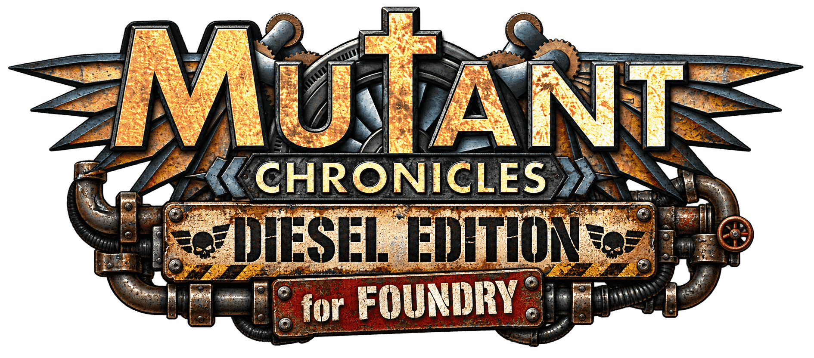
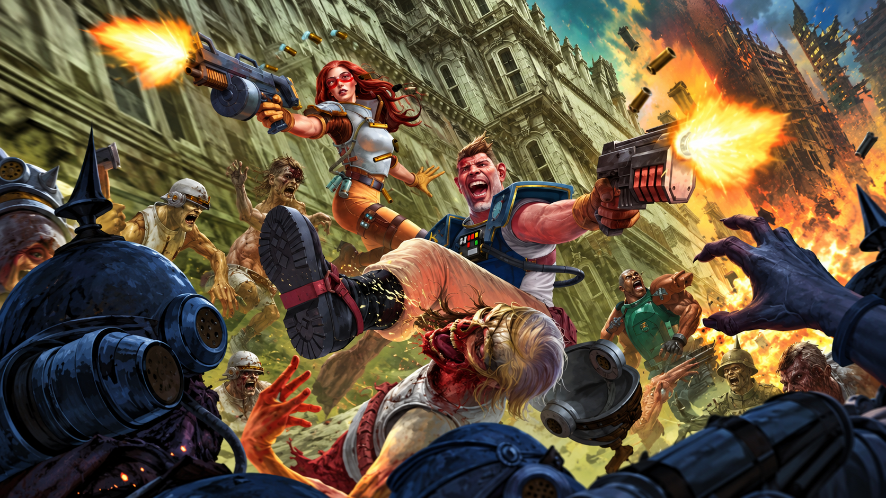

<p align="center">
  
</p>

<p align="center">
  
</p>

<p align="center">
  <strong>Unofficial Foundry VTT system for Mutant Chronicles 2D20, Diesel Edition (Modiphius).</strong><br>
  Compatible with <strong>Foundry VTT V14</strong>.
</p>

---

## About

This is a fan-made Foundry VTT system implementing the *Mutant Chronicles 2D20, Diesel Edition* ruleset. It provides full character, NPC, Nemesis and Vehicle sheets, automated 2d20 dice mechanics, and a set of ready-to-use compendiums to get a game running quickly.

> **Built with AI assistance.** Development of this system's code, sheets, and styling was done with the help of AI tools.

## Features

- **Full ApplicationV2 / DialogV2 sheets**, built for and tested on Foundry VTT V14.
- **Character sheets** for Player Characters, NPCs, Nemesis, and Vehicles, each with their own dedicated layout and mechanics.
- **Automated dice rolling** for the Mutant Chronicles 2d20 system:
  - Standard skill and attribute tests, with Chronicle Point and Dark Symmetry Point spends.
  - Weapon attack rolls with Let Rip, Exploit Weakness, Surprise, and Brace modifiers.
  - Damage rolls using Dark Symmetry Dice (DSD), with hit location and soak resolution.
  - NPC/Nemesis-specific dice rules, including Horde/Squad free dice and Dark Symmetry Point spends.
  - Vehicle piloting tests and vehicle weapon attacks.
- **Combat tracking**: wound tracks (Serious, Critical, Mental), hit locations with soak, armor management, and Dread/Chronicle Point trackers.
- **Vehicle support**: crew assignment (pilot/gunner), armaments, fuel, and impact damage.
- **Dice So Nice integration** with custom Dark Symmetry dice faces.
- **Ready-to-use compendiums**: Critical Injuries table, Armors & Equipment, Weapons & Weapon Qualities, Talents & Spells, Special Abilities, pre-generated Dark Symmetry characters, NPCs, Vehicles (Luna P.D.), Macros, and Scenes.
- A custom "engraved bronze plate" visual theme applied consistently across sheets and dialogs.

## Installation

In Foundry VTT, go to **Game Systems → Install System** and paste the following manifest URL:

```
https://raw.githubusercontent.com/SebsokK/mutant-chronicles-diesel-edition/main/system.json
```

## Compatibility

- **Minimum / Verified Foundry VTT version:** 14

## Credits

- Mutant Chronicles 2D20 is a property of Modiphius Entertainment. This is an unofficial, fan-made system and is not affiliated with or endorsed by Modiphius.
- System development: SokK, with AI assistance.
